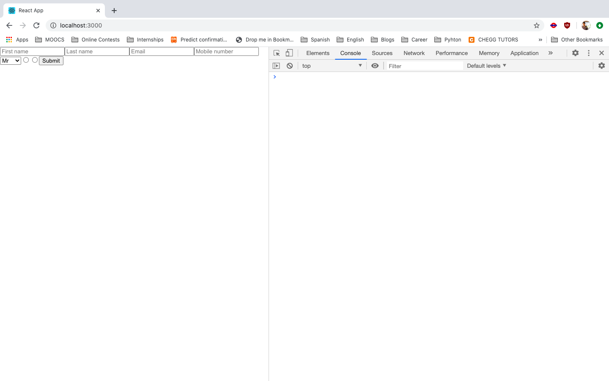
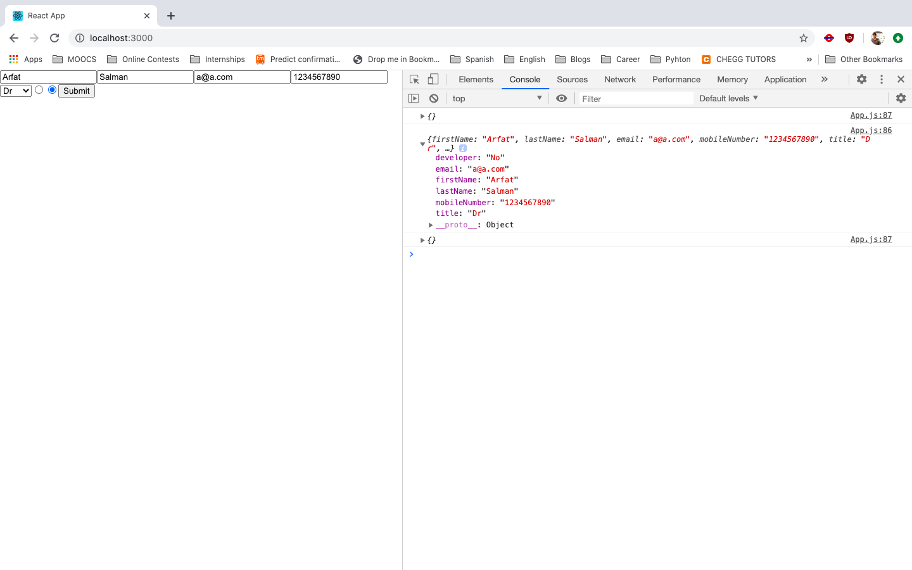

# Instructions

You have to create a hook called `useForm` that manages HTML form elements.

## Input
- _None_

## Output
- An object containing two functions and an object described below.
```js
  const { register, handleSubmit, errors } = useForm(); // initialise the hook
```
  - `register` is a function that can be passed to `ref` prop of an HTML `input` or `select` element and "registers" it.
```js
<input name="firstname" ref={register} /> {/* register an input */}
``` 

  - `handleSubmit` is a higher-order function that wraps the callback to `onSubmit`. See the example below,

```jsx
const onSubmit = (data) => {
  console.log(data);
};
<form onSubmit={handleSubmit(onSubmit)}>
</form>
```
The `onSubmit` handler must only be called when the user clicks on the submit button.

The `onSubmit` will get an object as a parameter which will contain key-value pairs corresponding to the form.

The keys will be the `name` prop of the field, and the value will be whatever value the user has input. See the screenshots below to see an example.

- `errors` object which will contain validation checks. The error checks will use the same key as the `name` prop of the registered field. See the following example --
```js
<input name="lastname" ref={register({ required: true })} />
{errors.lastname && 'Last name is required.'}
```
_Note_: Take a note of how the `register` is called. It is given an object which contain the validation checks.

The `errors` can be updated when the submit button is clicked. Though, any other technique is also fine.


`register` can be passed to the `ref` prop directly or it can be called with an object containing validation checks.

### Validations that can be passed to `register`
- `required` which can be `true` or `false`
- `maxLength` which will be a number. If the length of input value is bigger than `maxLength`, this check will fail.

### Structure of `errors` object
- If there are no validation errors, the object should be empty.
```js
{}
```
- If the error is of the type `required` (that is, it was required but was not input by the user), this is the structure of the error object--
_Assuming `name` prop of the field is `foo`_
```js
{
  foo: {
    required: true
  }
}
```
- If the error is of the type `minLength`, the structure will be
```js
{
  foo: {
    minLength: true
  }
}
```
- Let's say if both `required` and `minLength` are validation errors, then
```js
{
  foo: {
    minLength: true,
    required: true,
  }
}
```

## Constraints
- You can assume that only `input` or `select` element will be used in the `form` element. No other `form` element needs to be handled.
- Only HTML elements will be used and `ref` will not be used on class components or functional components.

## Example
```js
function App() {
  const { register, handleSubmit, errors } = useForm();
  const onSubmit = (data) => console.log(data);

  console.log(errors);

  return (
    <form onSubmit={handleSubmit(onSubmit)}>
      <input
        type="text"
        placeholder="First name"
        name="firstName"
        ref={register({ required: true, maxLength: 80 })}
      />
      <input
        type="text"
        placeholder="Last name"
        name="lastName"
        ref={register({ required: true, maxLength: 100 })}
      />
      <input
        type="text"
        placeholder="Email"
        name="email"
        ref={register({ required: true })}
      />
      <input
        type="tel"
        placeholder="Mobile number"
        name="mobileNumber"
        ref={register({ required: true, maxLength: 12 })}
      />
      <select name="title" ref={register({ required: true })}>
        <option value="Mr">Mr</option>
        <option value="Mrs">Mrs</option>
        <option value="Miss">Miss</option>
        <option value="Dr">Dr</option>
      </select>

      <input
        name="developer"
        type="radio"
        value="Yes"
        ref={register({ required: true })}
      />
      <input
        name="developer"
        type="radio"
        value="No"
        ref={register({ required: true })}
      />

      <input type="submit" />
    </form>
  );
}
```

## Screenshots
- The first render of the above example  

- After I fill the form, I click on submit  


_The first and last printed `{}` is because of `console.log(errors)`, which is an empty object as there are no validation checks that are failing._  

_The two radio buttons that are side-by-side **should** be wrapped in a `label` to identify them. However, we disregard that for this question. You can see the source code and find the two radio buttons listed above._  

_Don't worry about styling your forms_

Your code may **NOT** be printing things in the same order as shown in the screenshots above. **That's fine**. The result will be checked after clicking on the submit button, and as long as the correct structure is created with the data, the test cases will pass.

## Restrictions
- Don't use external libraries